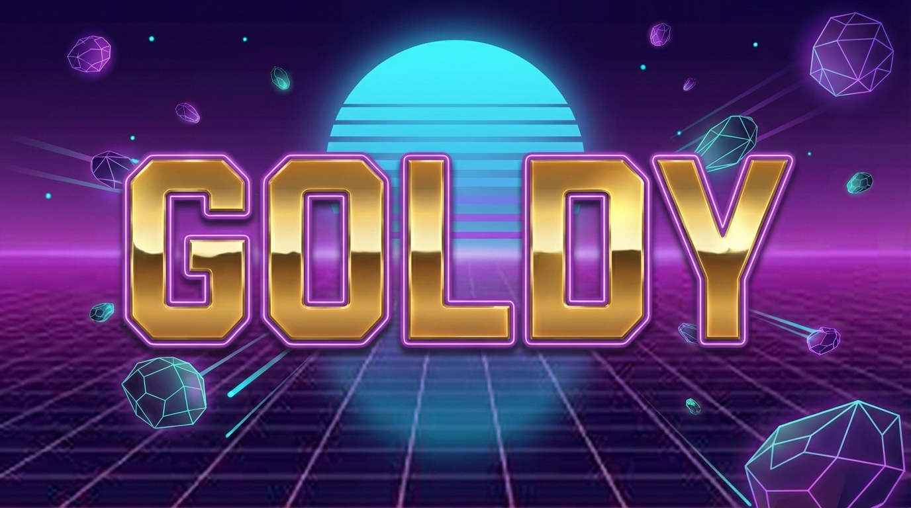

<p align="center">
  
</p>

# Goldy: Modern GPU Library

[](https://opensource.org/licenses/MIT)

A modern Rust GPU library that deliberately sheds legacy baggage. Goldy targets only modern GPU APIs (Vulkan 1.4+, DX12, Metal) and can therefore be significantly simpler than libraries that must maintain backward compatibility.

## Quick Example

```rust
use goldy::{Instance, DeviceType, Buffer, DataAccess, Color, CommandEncoder, FrameOutput, TextureFormat};

fn main() -> anyhow::Result<()> {
    let instance = Instance::new()?;
    let device = instance.create_device(DeviceType::DiscreteGpu)?;
    
    let frame = FrameOutput::new(&device, 800, 600, TextureFormat::Rgba8Unorm);
    let mut encoder = CommandEncoder::new();
    {
        let mut pass = encoder.begin_render_pass();
        pass.clear(Color::CORNFLOWER_BLUE);
    }
    
    let pixels = frame.render(encoder)?;
    Ok(())
}
```

## Features

| Attribute | Description |
|-----------|-------------|
| **Rust-native** | Idiomatic Rust API, not a wrapper around C |
| **Modern-only** | Vulkan 1.4+, DX12, Metal baseline |
| **Slang shaders** | Single shader language for all backends |
| **Legacy-free** | No OpenGL, no Vulkan <1.4, no OpenCL |
| **Unified** | Graphics and compute in one API |
| **Fast-moving** | Not a standard—can iterate quickly |

## Installation

```toml
[dependencies]
goldy = "0.1"
```

### Slang Compiler

Goldy uses [Slang](https://github.com/shader-slang/slang) for shader compilation. The build script automatically downloads Slang 2026.4 during compilation. You can also:

- Set `GOLDY_SLANG_PATH` to use a custom Slang installation
- Run `slang/download.sh` to manually download vendored binaries

For FFI bindings (Python, .NET, C++), Slang libraries are bundled automatically by the respective build scripts. See [PACKAGING.md](PACKAGING.md) for architecture details and [DEBUGGING.md](DEBUGGING.md) for troubleshooting.

## Documentation

📖 **[Full Documentation](https://koubaa.github.io/goldy/)**

- [Getting Started](https://koubaa.github.io/goldy/getting-started/installation.html)
- [Examples](https://koubaa.github.io/goldy/examples/overview.html)
- [API Reference](https://koubaa.github.io/goldy/reference/api.html)
- [Design Philosophy](https://koubaa.github.io/goldy/design/motivation.html)

## Examples

Run the interactive examples:

```bash
cargo run --example triangle --release      # Basic triangle
cargo run --example digital_clock --release # 7-segment clock
cargo run --example plasma --release        # Demoscene plasma
cargo run --example mandelbrot --release    # Fractal explorer
cargo run --example starfield --release     # 3D starfield
cargo run --example particles --release     # Rain/snow
```

### Selecting a Backend

By default, Goldy uses DX12 on Windows and Vulkan on Linux. Override with `GOLDY_BACKEND`:

```bash
# Run with Vulkan backend (on Windows)
GOLDY_BACKEND=vulkan cargo run --example triangle --release

# Run with DX12 backend
GOLDY_BACKEND=dx12 cargo run --example triangle --release
```

See [all examples](https://koubaa.github.io/goldy/examples/overview.html).

## Motivation

Goldy is inspired by Sebastian Aaltonen's ["No Graphics API"](https://www.sebastianaaltonen.com/blog/no-graphics-api) vision of what's possible with modern GPU hardware. By targeting only modern GPUs (2018+), Goldy can:

- Use dynamic rendering (no render pass objects)
- Use bindless descriptors (no descriptor sets)
- Assume coherent caches (simpler synchronization)
- Provide a dramatically simpler API

Goldy is also inspired by:
- Wayland's compositor architecture
- Ralph Levien's ["Requiem for piet-gpu-hal"](https://raphlinus.github.io/rust/gpu/2023/01/07/requiem-piet-gpu-hal.html)
- Slang's vision for unified shader language
- [WGPU](https://gfx-rs.github.io/2019/03/06/wgpu.html)
- This paper on GPU abstractions: https://www.kom.tu-darmstadt.de/papers/KCGS17.pdf

Read more in [Design Philosophy](https://koubaa.github.io/goldy/design/motivation.html).

## Matrix Convention

Goldy uses **column-major** matrix layout in uniform/constant buffers across all backends. This matches the native memory layout of Rust math libraries (glam, nalgebra, ultraviolet), so you can upload matrices directly without transposing:

```rust
let uniforms = MyUniforms {
    projection: proj.to_cols_array_2d(),
    modelview: view.to_cols_array_2d(),
};
buffer.write_data(0, &[uniforms])?;
```

Goldy sets `SLANG_MATRIX_LAYOUT_COLUMN_MAJOR` at the Slang session level, which emits `column_major` qualifiers in HLSL/DXIL output. This means DX12, Vulkan, and Metal all interpret `float4x4` the same way — no platform-specific transpose needed.

## Target Hardware

| Platform | Minimum |
|----------|---------|
| NVIDIA | RTX 2000 / GTX 1600 (2018+) |
| AMD | RDNA 1 / RX 5000 (2019+) |
| Intel | Xe / Alchemist (2022+) |
| Apple | M1 / A14 (2020+) |

## Development

Before submitting a PR, run the CI checks locally:

```bash
cargo fmt --all -- --check
cargo clippy -- -D warnings
cargo test
```

## License

MIT License - see [LICENSE](LICENSE) for details.

## Author

Mohamed Koubaa

## Contributing

Contributions welcome! See [CONTRIBUTING](https://koubaa.github.io/goldy/contributing.html).
