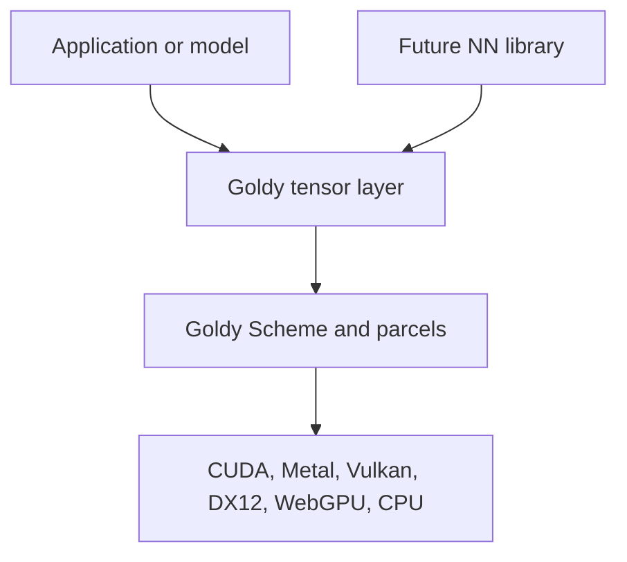

# Tensor Algebra

Goldy's `tensor` feature is a batteries-included **dense tensor algebra** over parcels.
It is not an ML framework: there is no autograd, no `nn.Module`, no optimizer, and no
Llama-specific operators. A future neural-network library can compete with `torch.nn`
by building on this layer.



Enable it with the `tensor` Cargo feature (on by default; independent of `graphics`):

```toml
goldy = { version = "0.3", features = ["tensor"] }
# CUDA compute-only, no graphics:
# goldy = { version = "0.3", default-features = false, features = ["cuda", "tensor"] }
```

## What the layer owns

- Concrete ranks 0..=4, dtypes `F32` / `U32` / `I32`
- Packed row-major storage plus positive/zero-stride views
- Checked `narrow`, `reshape`, `permute`, `transpose`, `broadcast_to`
- Shape inference, output allocation, and recording into the **same** [`Scheme`](../programming-model/parcels.md)
- Portable elementwise / reduction / gather / scatter kernels plus a tensor front-end for [semantic MatMul](./matmul.md)

## What it does not own

Autograd, parameters, optimizers, model formats, RMSNorm, RoPE, attention, activations
as NN layers, KV-cache policy, tokenization, symbolic shapes, or negative strides.

Low-level `Scheme`, `Buffer`, `Parcel`, and `MatMulView` APIs remain escape hatches.

## Views are lenses

A [`Tensor`] is a buffer parcel plus layout metadata. A [`TensorView`] never mints a new
ownership identity. Binding a view:

1. Claims a conservative byte envelope (`BufferRange`, or the parent buffer) so overlapping
   aliases stay visible to Goldy's hazard analysis.
2. Uses the **parent** bindless slot so shaders see the whole buffer plus element offsets.

Read-only broadcast views (zero stride on an expanded axis) share that envelope; they are
not independent identities. Write layouts require a positive stride on every axis with
`shape > 1`.

Host updates and observations still go through [`MemoryExchange`](./settlement.md).

## Recording

[`TensorKernels`] prepares portable kernels. Layout parcels intern onto the [`Scheme`](../programming-model/parcels.md) at record time, so the kernels object only needs to live while you are recording. [`TensorRecorder`] borrows the kernels and a mutable
`Scheme`:

```rust,no_run
# use goldy::{Instance, RequestAdapterOptions, RuntimeDescriptor, Scheme, Tensor, TensorKernels, TensorShape};
# fn main() -> Result<(), goldy::GoldyError> {
# let runtime = Instance::new().unwrap().request_adapter(&Default::default()).unwrap().request_runtime(&Default::default()).unwrap();
# let ctx = runtime.create_context().unwrap();
let kernels = TensorKernels::new(&runtime)?;
let a = Tensor::from_f32(&runtime, TensorShape::vector(4), &[1.0, 2.0, 3.0, 4.0])?;
let b = Tensor::from_f32(&runtime, TensorShape::vector(1), &[10.0])?;
let mut scheme = Scheme::new(&ctx);
let c = kernels.recorder(&mut scheme).add("add", a.view(), b.view())?;
# let _ = c;
# Ok(())
# }
```

Allocating methods (`add`, `matmul`, `sum`, …) create packed outputs. `_into` forms
(`add_into`, `matmul_into`, `cast_into`, `fill`) use caller storage, including in-place
work when the write layout is legal.

Custom `#[goldy::compute]` kernels can take `gpu::Tensor<T>` parameters and
index them as logical views, or bind `Tensor` / `TensorView` like any other
parcel for physical indexing:

```rust,ignore
// Logical: view[i] applies offset/shape/strides. Layouts live on the scheme.
kernel.record(&mut scheme, "rope", q_view, k_layer, &step, theta)?
    .over_tensor(&q_view);

// Physical escape hatch: buf[i] is a parent-buffer element index.
kernel.record(&mut scheme, "double", &data.view(), n).over_tensor(&data.view());
```

Kernel parameters may declare a **shape contract** that `record` checks before
GraphIR insertion. The list fixes rank; repeated names must match; `_` is
unconstrained; integer literals are exact extents. Unannotated tensors stay
any-shape. See [Rust compute kernels](../programming-model/rust-kernels.md).

```rust,ignore
fn rmsnorm(
    #[tensor(shape = [dim])] x: gpu::Tensor<f32>,
    #[tensor(shape = [dim])] weight: gpu::Tensor<f32>,
    #[tensor(shape = [dim])] out: gpu::TensorWrite<f32>,
) { /* ... */ }
```

```rust,ignore
fn rope(
    #[tensor(shape = [q_heads, head])] q: gpu::TensorMut<f32>,
    #[tensor(shape = [seq, kv_heads, head])] k: gpu::TensorMut<f32>,
    step: &[DecodeStep],
    theta: f32,
) {
    let k_base = pos * k.dim(1) * k.dim(2);
    k[k_base + i] = ...;
}
// host: pass layout.embedding(weights)? and layer_cache(key_cache, layer)?
```

Packed checkpoint pointer walking stays in the ingestion crate. It is the
single boundary that translates foreign offsets into validated `TensorView`s.

## Operations

| Family | Ops | Notes |
|--------|-----|-------|
| Construction | `zeros`, `from_f32` / `from_u32` / `from_i32`, `fill`, `copy`, `contiguous`, `cast` | Per-op dtype support |
| Unary | `neg`, `abs`, `exp`, `log`, `sqrt`, `reciprocal` | F32 |
| Binary | `add` / `sub` / `mul` / `div` / `min` / `max` and `*_scalar` | F32, NumPy-style broadcasting |
| Reductions | `sum`, `max_reduce`, `min_reduce`, `mean` | One axis; squeezed by default |
| Gather / scatter | `gather`; `scatter` with [`ScatterMode`] | Modes are explicit: `UniqueWrite`, `Add`, `Min`, `Max` |
| Matmul | rank-1/2 and batched rank-3 | Rank-2 packed cases lower to `Scheme::matmul` (cuBLAS / MPS / stdlib) |
| Softmax | composition of max / sub / exp / sum / div | Convenience only; not fused attention |

Scatter `Add` / `Min` / `Max` are defined (a single thread walks colliding indices). They are
**not** idempotent on scheme replay if the destination is the accumulator; unique-write and
pure functions of the inputs are.

## Bindings

The `tensor` Cargo feature is passed through to `goldy-ffi`, `goldy-ffi-client`, and
`goldy-py`. C (`goldy.h`) and C++ (`goldy.hpp`) expose acquire / add / matmul / fill.
Python copies NumPy arrays into tensors on acquire and reads results back through
[`MemoryExchange`](../programming-model/parcels.md) on `tensor.parcel()` — there is no
arbitrary zero-copy host view of GPU storage.

## llama3.goldy

[`llama3.goldy`](https://github.com/koubaa/llama3.goldy) is the proving consumer: activations
and checkpoint weights are tensors. Static GEMVs and residuals go through Ammon's
`TensorKernels` (Goldy semantic matmul / portable add). Custom RMSNorm / RoPE /
attention / SwiGLU kernels bind tensor views with rank and symbolic-extent
contracts; the host reshapes Q, KV cache, and attention scores at recording
boundaries. Dynamic decode state stays a `DecodeStep` deposit.
