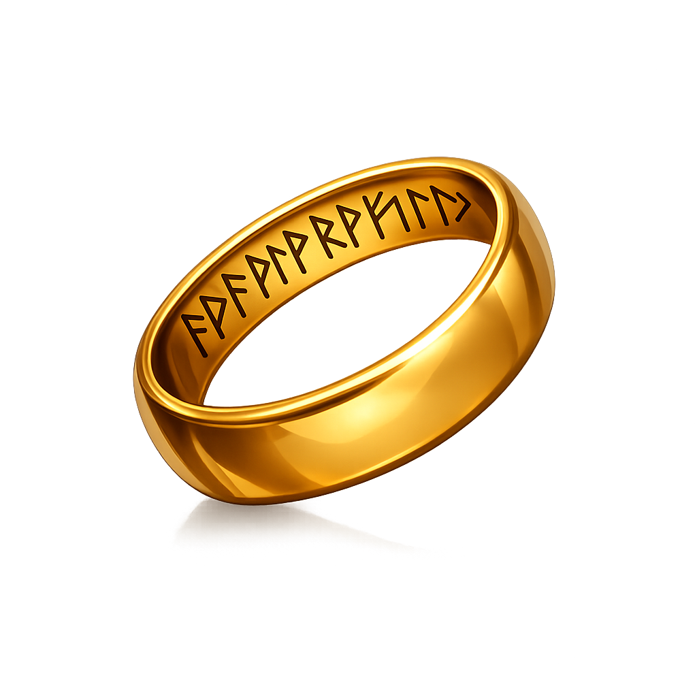

<p align="center">
  
</p>

# Goldy: Modern GPU Library

**Goldy** is a Rust GPU library built around a typed bindless programming model, a dependency-driven scheme, and first-class compute support — targeting Vulkan 1.4+, DX12, and Metal Tier 2+ with native backends (no translation layers).

## Typed Bindless Programming

Shaders are written in Slang using `goldy_exp` virtual entry points (`[goldy_compute]`, `[goldy_vertex]`, `[goldy_fragment]`). Resources are declared as typed parameters — the Goldy compiler resolves bindless slots automatically:

```c
import goldy_exp;

[goldy_compute]
[numthreads(64, 1, 1)]
void cs_main(MyUniforms cfg, Scattered<uint> data, ThreadId id) {
    data[id.x] = data[id.x] + cfg.base;
}
```

| Type | Maps To | Use |
|------|---------|-----|
| `Scattered<T>` | `RWStructuredBuffer<T>` | Read/write storage |
| `BufRO<T>` | `StructuredBuffer<T>` | Read-only storage |
| `DirectSpatial<T>` | `RWTexture2D<T>` | Read/write texture |
| `Interpolated<T>` | `Texture2D<T>` | Sampled texture |
| `Filter` | `SamplerState` | Texture sampler |
| `ThreadId` | `SV_DispatchThreadID` | Compute thread index |
| `VertexId` | `SV_VertexID` | Vertex index |

Struct parameters are automatically treated as broadcast (constant buffer) data.

## Scheme

[`Scheme`](https://docs.rs/goldy/latest/goldy/struct.Scheme.html) is Goldy's public recording API. You declare nodes, render passes, and resource dependencies once; the scheme is retained across submissions. Goldy inserts barriers, parallelizes independent work, and aliases transient resources:

```rust
let mut scheme = Scheme::new(&ctx);
scheme
    .node("simulate", &sim_pipeline)
    .with_parcel(&particles, NodeAccess::ReadWrite)
    .dispatch(group_count, 1, 1);
let submission = scheme.submit()?;
```

## Compute-to-Surface

Compute shaders can write directly to swapchain drawables via [`SurfaceExchange::bind_destination`](https://docs.rs/goldy/latest/goldy/struct.SurfaceExchange.html#method.bind_destination) — no graphics pipeline, no vertex buffers, no raster pass. Record once, submit each frame, claim and consume:

```rust
let surface = SurfaceExchange::new(&ctx, &window, SurfaceConfig::default())?;

let mut scheme = Scheme::new(&ctx);
let (lease, present) = surface.bind_destination(&mut scheme)?;
scheme
    .node("compute", &compute_pipeline)
    .with_parcel(&uniform_buffer, NodeAccess::Read)
    .with_present(&lease)
    .dispatch(wg_x, wg_y, 1);

// Each frame:
let mut submission = scheme.submit()?;
present.claim(&mut submission)?.consume()?;
```

## Multi-Backend, Single Shader Language

Goldy compiles Slang shaders to SPIR-V (Vulkan), DXIL (DX12), and Metal IR at runtime via the bundled Slang compiler. Each backend is a native implementation — Metal uses Metal idioms, not translated Vulkan.

| Platform | Backend |
|----------|---------|
| Linux | Vulkan |
| Windows | DX12 (Vulkan optional) |
| macOS | Metal |

## Quick Links

- [Installation](./tutorial/installation.md)
- [Your First Triangle](./tutorial/first-triangle.md)
- [Your First Compute Shader](./tutorial/first-compute.md)
- [GitHub Repository](https://github.com/koubaa/goldy)

## License

Goldy is licensed under the **MIT License**. See [License](./license.md) for details.
